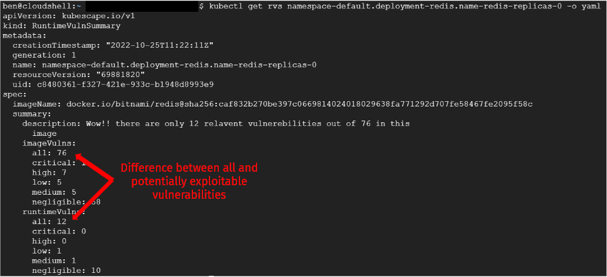

# TL; DR

Sneeffer is a magic tool that makes some of your vulnerabilities disappear 🪄 😎

This tool is a results of a POC project. It calculates image vulnerabilities based on (Syft and Grype) in a Kubernetes cluster with an eBPF (Falco) twist! It monitors PODs from their start till a limited time to view their file activity and discover which software packages are used in runtime and which are not. Based of this it can remove the packages from vulnerability report that not used therefore cannot be exploited!

See yourself:



# More about Sneeffer

The goal of Sneeffer is to find which vulnerabilities (CVEs) are relevant for a specific application of a container by monitoring its file activity and discovering which software packages are touched.

Sneeffer is using [Falco](https://falco.org/) base libraries for monitoring container file activity in Kubernets. These libraries are injecting eBPF code to the kernel which monitors relevant Linux system calls.
The ebpf-engine that Sneeffer is using can be found in following link: https://github.com/kubescape/ebpf-engine

## Prerequisites

In general, Sneeffer will work where Falco can run. We have tested it with some of-the-shelf managed clusters and it worked! (GKE, EKS and minikube)  

Follow the steps below for every cluster node:

1. Confirm that the nodes you want to run Sneeffer on are running Linux kernel version >= 4.14 
2. Install the relevant Linux headers for the Falco engine. Instructions for the supported distributions can be found in the [following link](https://falco.org/docs/getting-started/installation/)


> Note for minikube: In case of general K8s deployment, all cluster nodes must be installed with the relevant Linux headers. In case of minikube deployment the Linux headers must be installed in the minikube container.

## Usage

### Installation 

#### K8s DaemonSet

Sneeffer can be installed as a Kubernetes DaemonSet using the pre-built image, by running the following command:
```
kubectl apply -f https://raw.githubusercontent.com/kubescape/sneeffer/master/kubescape_sneeffer_daemonset.yaml
```
or
```
kubectl apply -f ./kubescape_sneeffer_daemonset.yaml
```
This will create the Sneeffer DaemonSet in the default namespace.

---

#### Building from source and running locally (minikube)

Follow the steps below to build Sneeffer from source and install it on your local minikube cluster. 

[Minikube must be installed](https://minikube.sigs.k8s.io/docs/start/) on your machine as a prerequisite.

1. Compile relevant binaries by running the following script:

```sh
./install_dependencies.sh
```

<i>This step can take ~15 minutes depending on your machine.</i>

2. Build Sneeffer

```
go build -o kubescape_sneeffer .
```

3. Run minikube:

```
minikube start
```

4. Run Sneeffer:

```
sudo SNEEFFER_CONF_FILE_PATH=./configuration/SneefferConfigurationFile.txt HOME=<your home directory> ./kubescape_sneeffer
```

> By default, when running Sneeffer locally (in a minikube setup), no change is needed to the configuration file. Make sure that `myNode` key in the configuration file matches to the machine running minikube (default value is `minikube`). In case your node name is different, update the configuration file located in `./configuration/SneefferConfigurationFile.txt`.

### Getting results

Install a workload (see limitations bellow) 

```
kubectl apply -f  https://raw.githubusercontent.com/kubernetes/website/main/content/en/examples/controllers/nginx-deployment.yaml
```

Then wait for the results (depending your configuration `snifferTime`, the default should be 5 minutes)
```
$ kubectl get rvs -w
NAME                                                             AGE
namespace-default.deployment-nginx.name-nginx-6799fc88d8-fmnlz   5m
$ kubectl get rvs namespace-default.deployment-nginx.name-nginx-6799fc88d8-fmnlz -o yaml
apiVersion: kubescape.io/v1
kind: RuntimeVulnSummary
metadata:
  creationTimestamp: "2022-10-25T05:24:30Z"
  generation: 1
  name: namespace-default.deployment-nginx.name-nginx-6799fc88d8-fmnlz
  resourceVersion: "69738865"
  uid: 7890b55e-d083-4db8-916b-c2a6065817cb
spec:
  imageName: docker.io/library/nginx@sha256:970fab39f49cfac758a2c9a73414a483fc56bded6f8c578c651408567dceb356
  summary:
    description: Wow!! there are only 8 relavent vulnerebilities out of 134 in this
      image
    imageVulns:
      all: 134
      critical: 2
      high: 17
      low: 6
      medium: 21
      negligible: 86
    runtimeVulns:
      all: 8
      critical: 0
      high: 0
      low: 2
      medium: 2
      negligible: 4
```

### Limitations
1. Meanwhile, we are supporting only public images 😢
2. Sneeffer only creates vulnerability results for PODs it saw starting.  

## Configuration file

> Defaults should just work!

| Configuration Key | Description                 |
|-------------------|-----------------------------|
|`innerDataDirPath` | Where to ave sbom and vuln data     |
|`kernelObjPath`    | Kernel object path <br>(it is compiled per node by init container)|
|`snifferEngineLoaderPath`| Path of binary loader of the kernel object to the container|
|`sbomCreatorPath`  | Path of binary which creates the SBOM (list of files existing in the image)|
|`vulnCreatorPath`  | Path of binary which calculated the list of CVEs for the image|
|`snifferTime`      | Monitoring time of the created container (minutes)|
|`loggerVerbose`    | Log verbose|
|`crdFullDetailedPath`| CRD yaml file path of the detailed runtime CVE data|
|`crdVulnSummaryPath` | CRD yaml file path of the summary runtime CVE data|
|`myNode`           | Name of the node that would be monitored|


### Example

```
innerDataDirPath=./data
kernelObjPath=./resources/ebpf/kernel_obj.o
snifferEngineLoaderPath=./resources/ebpf/sniffer
sbomCreatorPath=./resources/sbom/syft
vulnCreatorPath=./resources/vuln/grype
snifferTime=1 
loggerVerbose=INFO
crdFullDetailedPath=./resources/k8s/crd-vuln-full-detailes.yaml
crdVulnSummaryPath=./resources/k8s/crd-vuln-summary.yaml
myNode=minikube
```

